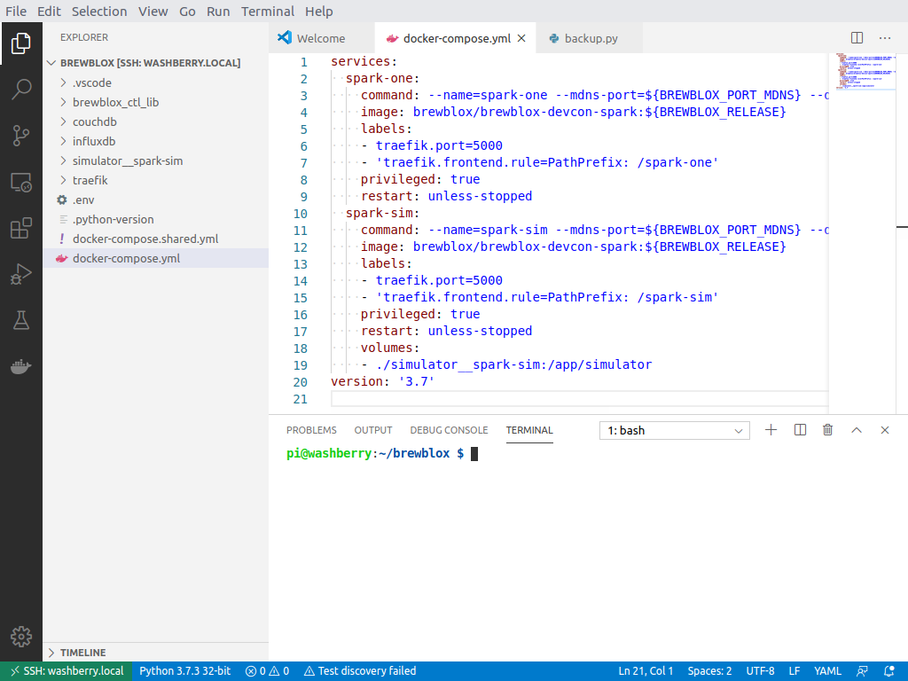

# Writing code remotely

By default we recommend to install the "lite" version of Raspbian, and connect to your Pi over SSH.

Other tutorials contain instructions for running code on your Pi.
There are terminal-based text editors, but they have a very steep learning curve.
A good solution is to write the code on your own computer, and then copy it to the Pi to run.

Below we outline some solutions for easily doing this. We'll stick with free solutions.

## FileZilla

If you prefer a GUI-based application, we recommend using [FileZilla](https://filezilla-project.org/).

The host field should be `sftp://IP_ADDRESS`. Username / password are the same as when logging in over SSH.

## Git Bash (Windows)

While Mac and Linux have a built-in SSH client, Windows is lagging behind.
[Git For Windows](https://git-scm.com/download/win) comes with Git Bash and an SSH client.

Install Git For Windows, run Git Bash, and you will have access to the `ssh` and `scp` commands.
To get started, you can follow [this guide](https://linuxize.com/post/how-to-use-scp-command-to-securely-transfer-files/).

## Visual Studio Code Remote Development

For directly editing and running files on your Pi, you can also use the [Remote Development plugin](https://code.visualstudio.com/docs/remote/remote-overview) for [VS Code](https://code.visualstudio.com/).

We use VS Code as our primary editor (we write code in Python / TypeScript / C++ / bash), and so far we've been very happy with it.

It must be noted that this approach is to be used for remotely edit and run code. If you need to copy other files (eg. backups), you'll still need to use `scp` or FileZilla.

