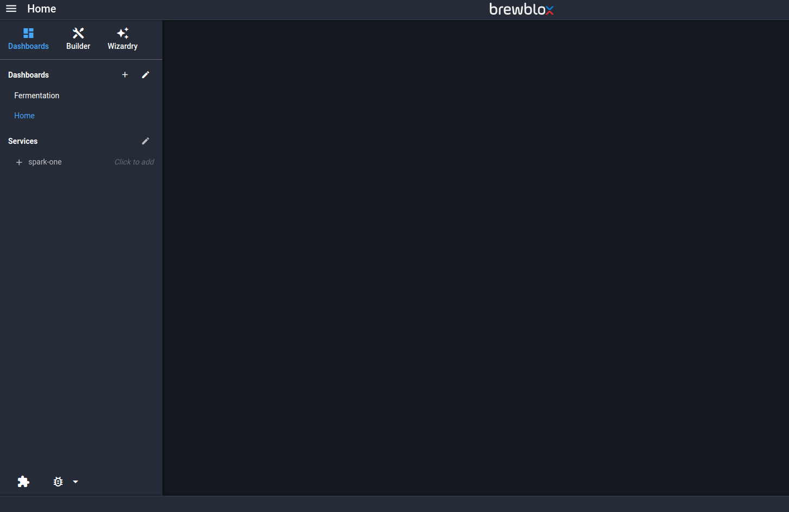

# Adding a Spark service

After you've followed the [Getting Started guide](./startup.md), you may want to connect your second or third Spark.

The [Multiple Devices](./multiple_devices.html) guide explains how Services work in BrewBlox. This guide walks you through the steps to add a new Spark service.

## What you will need

* Existing BrewBlox installation
* BrewPi Spark
* Micro-USB to USB cable

## Step 1: Stop your system

You'll be changing the configuration of your BrewBlox system. For the changes to take effect, you must stop and start your system.

In your BrewBlox directory (default: `./brewblox`), run this command:

```bash
brewblox-ctl down
```

## Step 2: Flash the firmware

::: warning
Make sure no other Sparks are connected over USB while you're flashing your controller.
:::

In your BrewBlox directory (default: `./brewblox`), run these command:

```bash
brewblox-ctl flash
brewblox-ctl wifi
```

Follow the instructions until the menu exits.

## Step 3: Start editing docker-compose.yml

Your `docker-compose.yml` file (located in the BrewBlox directory), contains the configuration for the Docker containers in your BrewBlox installation.

To edit it, run:

```
brewblox-ctl editor
```

You can now visit the editor page at `http://RASPBERRY_IP:8300`.

## Step 4: Add a Service

Services are configured using the [YAML](https://learnxinyminutes.com/docs/yaml/) markup language.

When settings are indented deeper (farther away from the left margin), it means they are nested inside the (less indented) parent.

The list of services will also include the first (default) Spark service. Its configuration will look something like:

```yaml
  spark-one:
    image: brewblox/brewblox-devcon-spark:rpi-${BREWBLOX_RELEASE:-stable}
    privileged: true
    restart: unless-stopped
    labels:
      - "traefik.port=5000"
      - "traefik.frontend.rule=PathPrefix: /spark-one"
    command: >
      --name=spark-one
      --mdns-port=${BREWBLOX_PORT_MDNS:-5000}
```

This settings in this configuration are explained in the [Multiple Devices](./multiple_devices.html) guide.

To create a new service, copy this block, but change the name from `spark-one` to something else. The name of the service in YAML, the traefik rule, and the value of the `--name` argument must all be the same.

Example (including old service):

```yaml
  spark-one:
    image: brewblox/brewblox-devcon-spark:rpi-${BREWBLOX_RELEASE:-stable}
    privileged: true
    restart: unless-stopped
    labels:
      - "traefik.port=5000"
      - "traefik.frontend.rule=PathPrefix: /spark-one"
    command: >
      --name=spark-one
      --mdns-port=${BREWBLOX_PORT_MDNS:-5000}

  spark-two:
    image: brewblox/brewblox-devcon-spark:rpi-${BREWBLOX_RELEASE:-stable}
    privileged: true
    restart: unless-stopped
    labels:
      - "traefik.port=5000"
      - "traefik.frontend.rule=PathPrefix: /spark-two"
    command: >
      --name=spark-two
      --mdns-port=${BREWBLOX_PORT_MDNS:-5000}
```

## Connecting to a specific Spark

By default, a Spark service will connect to the first Spark controller it can find. If you're using multiple Sparks, you want each service to connect to the same controller every time.

You can do this by using the `--device-host`, `--device-serial` and `--device-id` arguments. Services are independent: you can use `--device-host` for one service, and `--device-id` for the other.

The [Spark Connection Settings page](./connect_settings.html) explains how to use the various arguments.

## Step 5: Restart BrewBlox

When you are done editing (and have saved the configuration), go back to the terminal, and press Ctrl+C to exit the editor.

To start your system, run this command in your brewblox directory:
```
brewblox-ctl up
```

## Step 5: Add the service in the UI

When adding your service, the `Service ID` field must match the name you gave the service in `docker-compose.yml`. The `Service title` field is not important for configuration: pick a name that makes sense to you.


