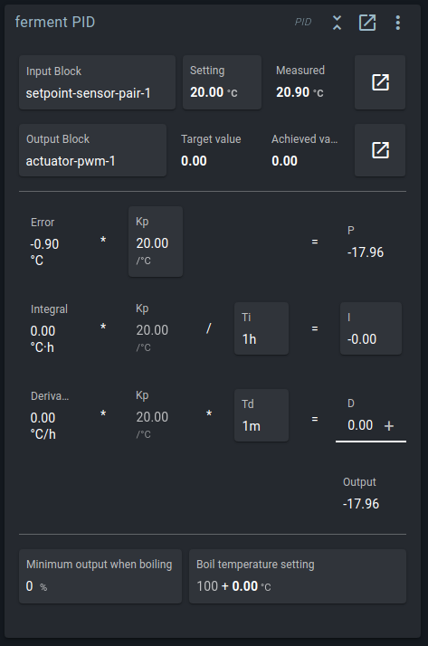
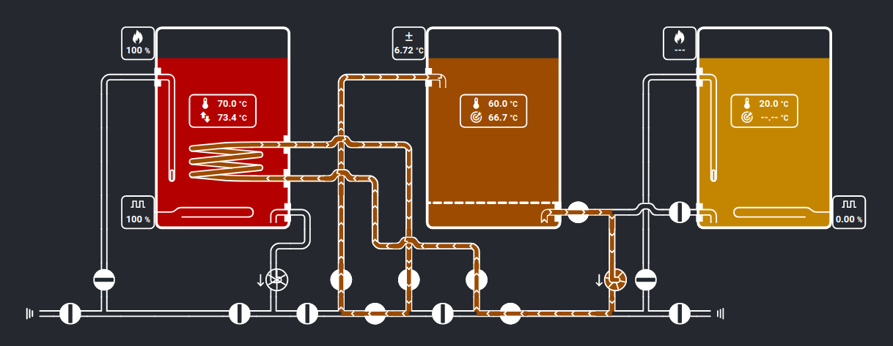
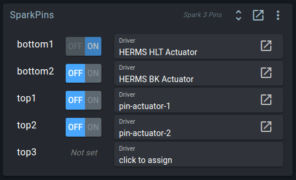

# Block types

::: tip
Blocks are combined to build [control chains](./control_chains.md).
:::

::: tip
For more information on blocks vs widgets, see the [Blocks in depth guide](./blocks_in_depth.md).
:::

::: tip
For a description of widgets, see the [Widget types page](./all_widgets.md).
:::

## Analog Actuator (Mock)

The `Analog Actuator (Mock)` block can often be ignored: it is mostly used for testing and development purposes.

It does not drive any pins, but can be used as an output block by the PID.

## Balancer

It is very common that the fuses simply can't handle all heating elements turning on at the same time. Using the `Balancer` block in combination with a `Mutex` block allows you to turn on multiple elements, and having them 'share' by rapidly alternating.

Usage of the Balancer block has its own section in the [control chains guide](./control_chains.md#when-you-only-have-power-for-1-element-sharing-power-over-multiple-elements).

A balancer is configured by creating the balancer itself, and then adding `Balanced` constraints to multiple PWM blocks, and `Mutexed` constraints to the Digital Actuators driven by those PWM blocks.

## Digital Actuator

Your physical devices are connected to the Spark using either an actuator port, or a OneWire port. In software, this results in a `Spark Pins`, `DS2413`, or `DS2408` block. `Digital Actuator` can target any of these.

This separation between software-only blocks (Digital Actuator), and hardware-linked blocks (pins), allows you to easily change output ports.

Digital Actuator blocks can either be driven by PWM blocks, or toggled manually. Spark/OneWire pins can't be toggled without a Digital Actuator.

`Minimum OFF time`, `Minimum ON time`, and `Mutually exclusive` constraints can be set.

When looking at history fields, you'll notice the Digital Actuator block has a both a `state`, and a `desiredState` field. `state` is read from the physical pin, and `desiredState` is set by either you or a PWM toggling the actuator. Every update tick, the firmware tries to make sure `state` equals `desiredState`. Constraints can deny this. 

For example: you have a Digital Actuator with a `Minimum ON time` (10 seconds) constraint, and a current state of OFF.

If you toggle the actuator, it will turn on. If you immediately try to toggle it again, it will remain on for 10 seconds, and then turn off. During this period, the widget will display a spinner, and a description of the currently limiting constraint.

## Display Settings

The Spark controller has a LCD screen that can show up to six blocks.
Sensors, setpoints, PWMs, and PIDs can be shown on the display.

You can use the `Display Settings` block to add blocks to the screen, or edit how they are displayed. Eligible blocks also have an `Add to Spark display` action in their action menu (top right button in the widget).

Note that the `DisplaySettings` block has its own temperature unit setting, separate from the service unit setting. If you wish to configure your system to use Fahrenheit, you will need to edit both settings.

## DS2408 Chip

Whenever you plug in a DS2408 OneWire extension board, a `DS2408 Chip` block is discovered. You can't manually create a DS2408 block (or any other discovered block).

DS2408 Chips are primarily used to control valves. In order to toggle the valve, you must connect a Motor Valve block.

Technically, you can connect Digital Actuators to DS2408 Chips. There is an [issue](https://github.com/BrewBlox/brewblox-firmware/issues/152) on the backlog for improving the distinction between DS2408 chips that are used for valves, and those used for actuators.

## DS2413 Chip

The `DS2413 Chip` is very much like the DS2408, except that it does not support valves.

Whenever you connect a OneWire extension board, it is discovered as a DS2413 chip. The two channels on this chip can be used as target for Digital Actuator blocks.

## Motor Valve

The `Motor Valve` functions like a Digital Actuator, except in that it controls valves, and is only compatible with the DS2408.

Motor Valve blocks can be driven by PWM blocks.

## Mutex

Many configurations involve behavior that shouldn't happen at the same time. This may be a fermentation that should either be heating or cooling (but not both at the same time), or a HERMS setup where running multiple heating elements concurrently would blow a fuse.

`Mutex` stands for **Mut**ually **ex**clusive. You set it up by adding a Mutex block, and then setting `Mutexed` constraints on all Digital Actuators that should be exclusive. You can have multiple independent Mutex 'groups' by adding more Mutex blocks.

You can then also add `Balanced` constraints on the PWM blocks to ensure that mutex time is being fairly shared among the actuators.

In both the Mutex block itself, and in the Mutexed constraint, you can configure the `extra lock time` setting. This prevents actuators from alternating too quickly.

If you set the `extra lock time` setting in a constraint, it will override the setting in the Mutex block.

## OneWire Temp Sensor

When you plug in a OneWire temperature sensor, a `OneWire Temp Sensor` block is discovered.

This block can either be used independently (to show temperature), or as input for a Setpoint block.

In its settings, you can configure an offset value for calibration purposes.

## PID

The minimal building blocks for a control system are:

- A sensor, to measure what you want to control. *(OneWire Temp Sensor block)*
- A setpoint, the target value for the sensor. *(Setpoint block)*
- An actuator, to drive the sensor value towards the setpoint. *(Digital Actuator block)*
- **A controller, to calculate what the value for the actuator should be from the sensor and setpoint value. *(PID block)***

The PID calculates the error, the difference between setpoint setting and sensor value, and keeps a history of to calculates an output value.
[Wikipedia](https://en.wikipedia.org/wiki/PID_controller) offers a good explanation of how PID controllers work.

The PID has more configuration settings than most other blocks.
If this seems daunting, and you just want to keep your fermentation fridge at 18°C: don't worry. QuickStart wizards create preconfigured PID blocks that need little to no changes.

Settings are divided in three sections:

**Input/output** settings are at the top. You can choose the previous and next blocks in the control chain here. Clicking on the `Setting` button will directly edit the Setpoint block.

**Calculation** settings are in the middle. This section shows both your settings, and how current values contribute to the output.

Other guides will go into more detail on how to configure `Kp`, `Ti`, and `Td`, but one thing is important to know: **If Kp > 0, it's a heating PID; if Kp < 0, it's a cooling PID**.

**Boil mode** settings are listed below. Boil mode is an optional feature in PIDs. You enable it by setting `Minimum output when boiling` to a non-zero value.

The reasoning behind boil mode is that temperatures behave differently during phase transitions. The liquid water in a boiling kettle will remain at +/- 100 °C (212 °F). You don't want your heater to turn off, but if you boil water by setting your setpoint to 110 °C, your PID would demand 100% output when it fails to reach the desired temperature.

When minimum boil output is set, the PID will use a higher output % to reach boil temperature, and then keep the kettle boiling by setting the output to at least the minimum output. This way, you can easily keep water boiling, without confusing the PID.

Whenever the Setpoint setting is less than (100 °C + `boil temperature setting`), boil mode does nothing.

## PWM

Digital Actuators can only be turned ON or OFF, but the PID calculation generates a numeric value, like 20 or 56. This is solved with a `PWM` block between the PID and the Digital Actuator.

PWM stands for [Pulse Width Modulation](https://en.wikipedia.org/wiki/Pulse-width_modulation). The PWM block has a configurable time period of for example 4 seconds.
It will turn ON the actuator for a part of that 4 second period and off for the remaining time.
A PWM value of 40% will turn ON for 1.6 seconds and OFF for 2.4 seconds and repeat.
This turns the digital ON/OFF actuator into an 'analog' numeric actuator with a range between 0% and 100%.

Somewhat like Digital Actuator, the PWM block has three history fields: `desiredSetting`, `setting`, and `value`. All three are in %.

**Desired setting** is the number set by either you, or by the PID.

**Setting** is the number after constraints have had their say. You can set `Minimum`, `Maximum`, and `Balanced` constraints. The Balancer will take `desiredSetting` of this and all competing PWMs into account when determining how much `setting` is granted.

**Value** is a historic number: what is the % of time that the actuator `state` has actually been ON? Differences between `setting` and `value` will mostly be the result of constraints on the actuator.

## Setpoint

A `Setpoint` block contains the target value for a control system, and has a link to the sensor block that is used to measure the actual value.

The Sensor and Setpoint are chained like this to allow for the Setpoint filtering the value reported by the Sensor. This prevents temperature spikes caused by measurement errors from upsetting the PID.

## Setpoint Driver

Not all systems can be described as a single `input - control - output` chain. Sometimes you have a system that indirectly impacts a different system.

The `Setpoint Driver` block allows us to have control chain A subcontracting work to control chain B without directly controlling its actuators.

We'll use the HLT and MT in a HERMS setup as a practical example.

The wort in the MT should be heated, but we don't want a heating element inside the MT, as it'll burn the grains. We evenly heat the wort by pumping it through a coil submerged in hot water in the HLT.

There is a control chain heating the HLT. It doesn't need to be micro-managed to achieve the desired temperature of *water in the HLT*.

That means the PID controlling the MT doesn't need to bother with the details of controlling the HLT temperature. *It can simply change the HLT setpoint.*

In the above picture the MT Setpoint setting is 66.7 °C (displayed in the middle kettle), and the PID calculated that the offset between HLT and MT Setpoints should be 6.72 °C. This value is shown at the top left of the MT kettle.

This is where the Setpoint Driver block came in. It set the HLT Setpoint setting to `66.7 °C + 6.72 °C = 73.4 °C`. You can see this value in the middle of the left-most kettle.

As the measured temperature in the MT approaches the setpoint, the calculated offset will go down.

The [control chains guide](./control_chains.md#controlling-beer-temperature-with-a-dynamic-fridge-setpoint) includes a section on when and how to use a Setpoint Driver block.

## Setpoint Profile

Whenever you want a Setpoint to change over time, you'll be using the `Setpoint Profile` block.

You configure it by setting a temperature value at specific times. The firmware will extrapolate all values between those two points, and gradually change the Setpoint.

In the above example, the Setpoint Profile is between two points, and changing temperature from 0 °C to 50 °C. It's about halfway, so the Setpoint is set to 27.27 °C.

All points are saved as an offset from the start time, so you can easily re-use profiles. You can also create, load, and save profiles from the action menu.

## Spark Pins

The `Spark 2 Pins` and `Spark 3 Pins` blocks are system blocks. They always exist. Unsurprisingly, it depends on the model of your Spark controller whether you'll see the Spark 2 or the Spark 3 version.

Spark pins can't be toggled without a Digital Actuator block, but the Spark Pins widget will show the current state of linked actuators. If you click on the toggle button here, it will toggle the desired setting in the actuator.

The Spark 3 version (but not the Spark 2) will also show current values for the 5V and 12V power supply.

## Temp Sensor (Mock)

While (re)configuring your system, it may be useful to see how it reacts to specific temperature values. 

The `Temp Sensor (Mock)` block can be placed in control chains wherever you'd place a OneWire Temp Sensor, but it allows you to manually set the 'measured' value.
