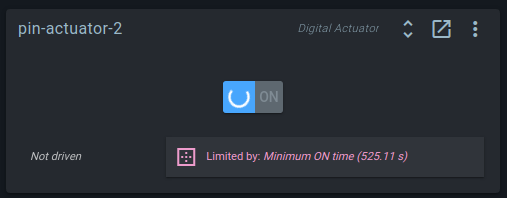

# Block types

::: tip
Blocks are combined to build [control chains](./control_chains.md).
:::

::: tip
For more information on blocks vs widgets, see the [Blocks in depth guide](./blocks_in_depth.md).
:::

::: tip
For a description of widgets, see the [Widget types page](./all_widgets.md).
:::

## Analog Actuator (Mock)

The `Analog Actuator (Mock)` block can often be ignored: it is mostly used for testing and development purposes.

It does not drive any pins, but can be used as an output block by the PID.

## Balancer

It is very common that the fuses simply can't handle all heating elements turning on at the same time. Using the `Balancer` block in combination with a `Mutex` block allows you to turn on multiple elements, and having them 'share' by rapidly alternating.

Usage of the balancer block has its own section in the [control chains guide](./control_chains.md#when-you-only-have-power-for-1-element-sharing-power-over-multiple-elements).

A balancer is configured by creating the balancer itself, and then adding `Balanced` constraints to multiple PWM blocks, and `Mutexed` constraints to the Digital Actuators driven by those PWM blocks.

## Digital Actuator

Your physical devices are connected to the Spark using either an actuator port, or a OneWire port. In software, this results in a `Spark Pins`, `DS2413`, or `DS2408` block. `Digital Actuator` can target any of these.

This separation between software-only blocks (Digital Actuator), and hardware-linked blocks (pins), allows you to easily change output ports.

Digital Actuator blocks can either be driven by PWM blocks, or toggled manually. Spark/OneWire pins can't be toggled without a Digital Actuator.

`Minimum OFF time`, `Minimum ON time`, and `Mutually exclusive` constraints can be set.

When looking at history fields, you'll notice the Digital Actuator block has a both a `state`, and a `desiredState` field. `state` is read from the physical pin, and `desiredState` is set by either you or a PWM toggling the actuator. Every update tick, the firmware tries to make sure `state` equals `desiredState`. Constraints can deny this. 

For example: you have a Digital Actuator with a `Minimum ON time` (10 seconds) constraint, and a current state of OFF.

If you toggle the actuator, it will turn on. If you immediately try to toggle it again, it will remain on for 10 seconds, and then turn off. During this period, the widget will display a spinner, and a description of the currently limiting constraint.

## Display Settings

The Spark controller has a LCD screen that can show up to six blocks.
Sensors, setpoints, PWMs, and PIDs can be shown on the display.

You can use the `Display Settings` block to add blocks to the screen, or edit how they are displayed. Eligible blocks also have an `Add to Spark display` action in their action menu (top right button in the widget).

Note that the `DisplaySettings` block has its own temperature unit setting, separate from the service unit setting. If you wish to configure your system to use Fahrenheit, you will need to edit both settings.

## DS2408 Chip

Whenever you plug in a DS2408 OneWire extension board, a `DS2408 Chip` block is discovered. You can't manually create a DS2408 block (or any other discovered block).

DS2408 Chips are primarily used to control valves. In order to toggle the actuator, you must connect a Motor Valve block.

## DS2413 Chip

## Motor Valve

## Mutex

## OneWire Temp Sensor

## PID

## PWM

## Setpoint

## Setpoint Driver

## Setpoint Profile

## Spark Pins

## Temp Sensor (Mock)
