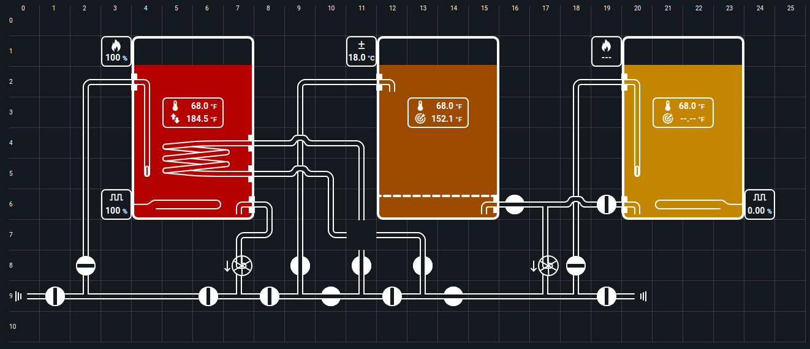
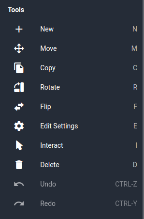
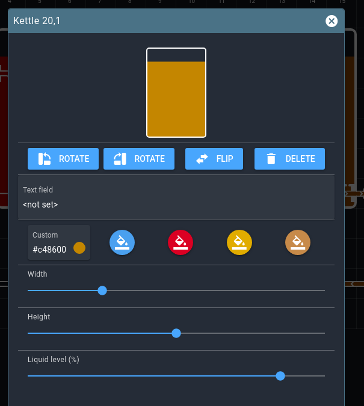

# Brewery Builder guide


The Brewery Builder is a responsive and fully configurable view of your system.
Whenever you open a valve or enable a pump, it will immediately show the new flow.

Quickstart wizards will automatically generate Builder widgets, but you can also add and edit them yourself.

```
- introduction
- widgets / editor
- layouts
- tools
- parts
- flows
- kettle / global inlets
- block links
```

## Builder widget, Builder editor



Builder widgets show your layouts, and allow you to interact with elements. To add, move, or edit parts, you need the Builder editor.

You can access it from the sidebar, or by double clicking on a builder widget.

## Layouts

Builder layouts are not bound to any single widget. You can select all layouts in the editor, and can use a widget to show any layout.

## Tools



In the Builder editor sidebar, you can find the tools required for changing your layout.

Either hover your cursor over the grid and press the shortcut, or select one or more parts, and then click the tool.

The function of most tools is fairly self-explanatory, but we'll take a closer look at two of them: `Edit Settings` and `Interact`.

**Edit Settings** will open a dialog with the settings available for a part. For many parts this will be fairly generic: rotate, flip, or remove the part.

Some have more settings. For example, the kettle allows setting:
- The label (displayed at the top)
- The liquid color.
- The width and height (in squares).
- The liquid level (for display only - ignored in flow calculations).



## Modes


Builder modes are always active, and change what happen when you first click on a part.

The default mode is `select`. Click, or click and drag in the grid to select one or more parts. You can then copy, move, or remove those parts.

Not all tools work when multiple parts are selected.

## Flow calculations

Whenever there is a viable route from a liquid source (a kettle or inlet) to a liquid sink (another kettle or inlet), the route and flow speed will be shown.

Building routes is fairly self-explanatory: if it looks like a tube, it'll work like a tube. Valves and pumps can be used to redirect and speed up flows.

To simulate height differences in your system, there's also the `Tube: gravity`. It works like a pump that's always on.

## Inlets

Liquid flows must always start and end at inlets. Simply having a tube without a connecting part does not count as being an inlet. There are two kinds: global inlets, and kettle inlets.

Flow direction is always determined by the pressure on both ends of the route. You can have a flow route where both start and end inlets have pressure: liquid will flow towards the inlet with the least pressure.

**global inlets** show liquid entering and leaving the system. You can use them to model fresh water taps, floor drains, kitchen sinks, or even tubes to and from other systems.

Enable the inlet in its settings dialog if it models an inflow of liquid. You can also customize liquid color here.

**kettle inlets** function like global inlets, but take their pressure and liquid color settings from the kettle they are placed in.
The kettle liquid color is not changed when a different liquid flows into the kettle.

## Linked blocks

todo
